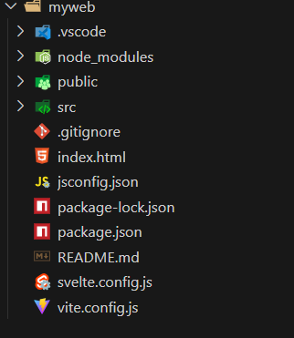
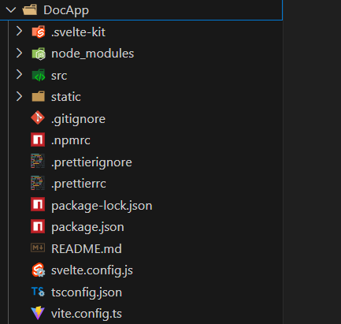

#  Waht is Svelte & SvelteKit

### 🟠 Svelte is Webframework that is used for front-End and Back-End for both so It is Full-Stack Framwork 

    1️⃣ Framwork
    2️⃣ Fast
    3️⃣ compiled like compiler langaue
    4️⃣ 


# 🏗️ How Setup Projects

-   # 🚅 First For Front-End side
  
### PreRequisties 👎
- You have installed VS-CODE
- You have installed Node-js 

    1️⃣ open Terminal(cmd or 
    powershell)
    
Type This commands On Terminal


# 👿 Alway ProjectName in Small 🔤 

```bash
npm create vite@latest <project_name> -- --template svelte

cd  <project>
npm install
npm run dev

# Here Each commands explanation
```
- 1 npm  : is nodeJS package Manager 👨‍🎨
- create : is used creation project 🚧
- vite@latest : for creating fastet way to construction project  🧰 


Perfect 👌 



Svelte project banane ke **multiple ways** hain, aur har ek ka apna **use-case, pros, aur cons** hota hai.
Main neeche **4 major approaches** explain kar raha hoon jo 2025 ke hisaab se relevant aur updated hain 👇

---

## 🧩 1. **Using Vite (Recommended for frontend projects)**

**Command:**

```bash
npm create vite@latest my-app -- --template svelte
cd my-app
npm install
npm run dev
```

### ✅ Pros

* ⚡ Super fast dev server and HMR (Hot Reload)
* 🧠 Simple, minimal setup (no config complexity)
* 🧱 Works great for frontend-only apps
* 📦 Supports TypeScript easily (`--template svelte-ts`)
* 🚀 Build optimized static assets for production

### ❌ Cons

* ❌ No built-in routing or backend support
* ❌ If you later want SSR (server-side rendering), you’ll need to migrate to SvelteKit manually

### 💡 Best for:

* Learning core Svelte
* Small-to-medium frontend projects
* Admin panels, dashboards, static websites

🟢 **Verdict:** ✅ *Best and fastest way to start for frontend-only learning (your current case)*

---

## 🌐 2. **Using SvelteKit (Full-stack framework for Svelte)**

**Command:**

```bash
npm create svelte@latest my-app
cd my-app
npm install
npm run dev
```
# or  
``` bash
npx sv create DocApp
```
### Using Above Commads it create this type of Project Directory 📁




### ✅ Pros

* 🌍 Built-in routing (like Next.js)
* 🧠 Supports SSR, CSR, and SSG all-in-one
* 💾 API routes + form handling + cookies + server logic
* 💨 Best for SEO and production-grade apps

### ❌ Cons

* ❌ Slightly more complex for beginners
* ❌ If you only need frontend, it’s overkill
* ❌ Need to understand routing conventions first

### 💡 Best for:

* Large-scale web apps
* SEO-friendly sites
* When you’ll add backend/API integration later

🟢 **Verdict:** ✅ *Best for long-term full-stack Svelte projects*

---

## 🧱 3. **Using Svelte-CLI (Legacy / Manual way)**

**Command:**

```bash
npx degit sveltejs/template my-app
cd my-app
npm install
npm run dev
```

### ✅ Pros

* Minimal, no extra dependency (pure Svelte)
* Great for internal tools or experiments

### ❌ Cons

* ❌ Old template — no modern optimizations like Vite
* ❌ Slow builds and HMR (compared to Vite)
* ❌ Deprecated for production use

### 💡 Best for:

* Quick tests or internal small experiments

🟠 **Verdict:** ⚠️ *Only for learning, not for serious projects*

---

## 🧰 4. **Using Svelte in Existing Apps (Embedded)**

You can add Svelte components **inside any existing JS project** (e.g., Django, Flask, Laravel, or vanilla HTML).

**Example:**

```bash
npm install svelte
```

Then manually compile your `.svelte` files into JS bundles and include them.

### ✅ Pros

* Great for integrating modern UI into legacy systems
* Useful when migrating step-by-step

### ❌ Cons

* ❌ Manual config required
* ❌ No dev server by default
* ❌ Not scalable for large apps

### 💡 Best for:

* Integrating Svelte into older web projects

🟠 **Verdict:** *Good for embedding, not for learning from scratch*

---

## 🧭 Final Recommendation (for You)

Since you said you’re focusing **only on frontend for now**,
✅ **Best approach → `Vite + Svelte`**
Simple, modern, and perfect to learn component system, reactivity, transitions, and stores.

Later, when you’re ready to build **full-stack apps or admin panels**,
then shift to ✅ **SvelteKit** (which uses Vite internally anyway).

---
